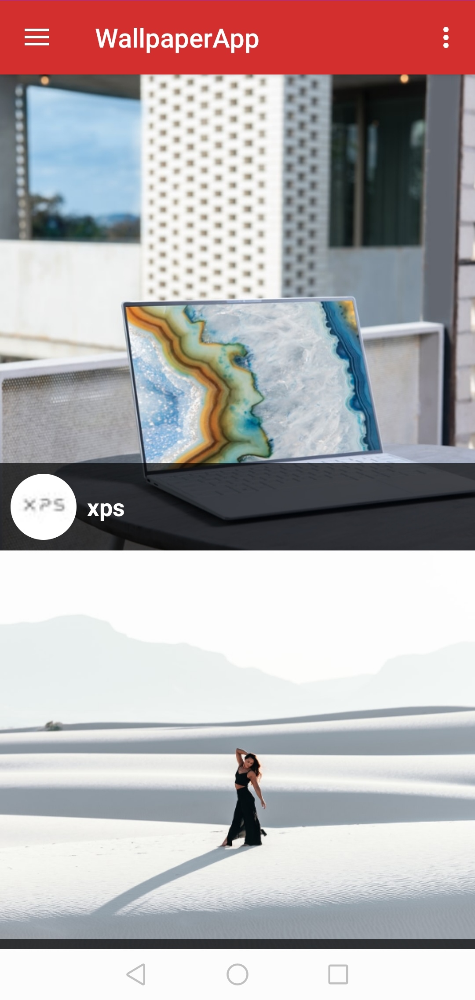
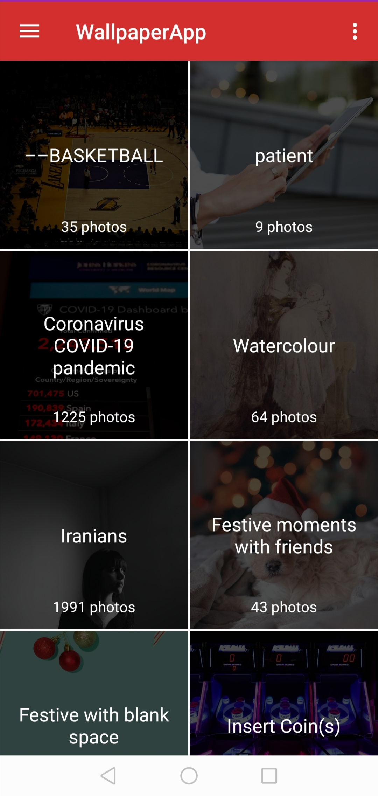
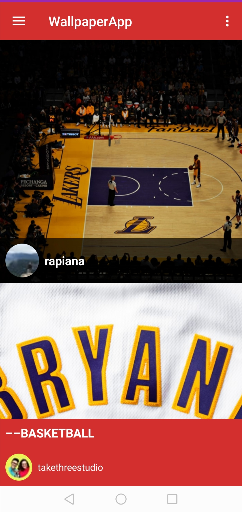
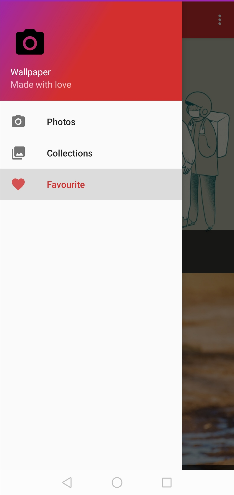
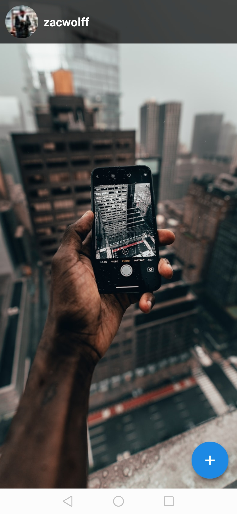
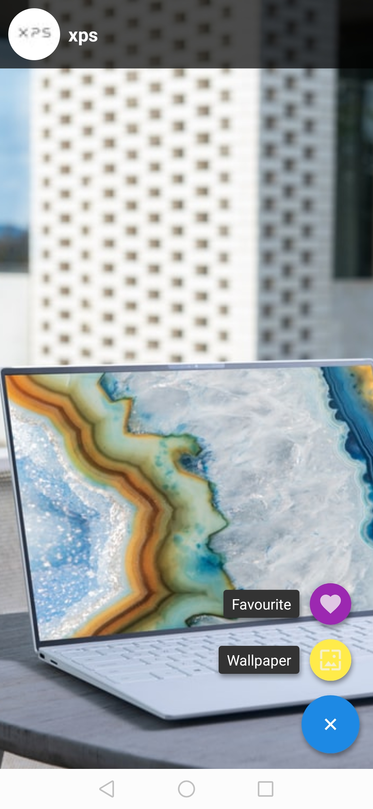

# PROJECT NAME. :iphone::performing_arts::camera_flash::bookmark:
The project is titled 'WallpaperApp'. The project basically functions as the title suggests.If you want to see more, you can view the live demo [here](https://appetize.io/app/kjgf04wqzeda66zvzxe5hjn9fr?device=nexus5&scale=75&orientation=portrait&osVersion=8.1).:paw_prints::paw_prints:

## AUTHOR NAME.
My name is Samuel and i am currently a learning software programmer at Moringa School.:man_technologist::man_technologist:

## DESCRIPTION OF PROJECT.
The project is a Java Android-platform based wallpaper application whose photos are made available by use of the Unsplash API. With this application, one is able to set wallpapers from the available pictures, and even add the more appealing ones to a favourites section, which is even viewable when the device is offline.
For more information on the individual photos, names and images of the authors have also been displayed. One is also able to view the featured collections from Unsplash.:medal_military::medal_military::trophy:
 

   
    
   
   
   
    
 

### PROJECT SETUP INSTRUCTIONS.
1. Fork this repository.
2. Clone this repository onto your local machine through use of the command `git clone <Forked-repository-link.>`. 
3. Navigate to your terminal.
4. Navigate the the appropriate directory by use of cd command `cd<root-folder>`.
5. In order to make any additional changes to the project, it is highly advised that you install Android Studio, the official IDE for Android.(Integrated Development Environment).
                                                                                                                                                                                                                                                                                                                                                                                                                                                                                                                                                                                                                                                                                                                                                                                                                                                                                                                                                                                                                                                                                                                                                                                                                                                                                                                                                                                                                                                                                                                                                                                                                                                                                                                                                   
## TECHNOLOGIES USED.
#### Main Requirements::signal_strength::high_brightness:
- Java- The main programming language used.
- Gradle - The main build automation tool used.
- JUnit - The main testing library used.
- [Android Studio](https://developer.android.com/studio) - The official IDE for creation of android apps.
#### Libraries used::card_index_dividers:
- [Glide](https://github.com/bumptech/glide) - A fast and efficient open source media management and image loading framework for Android that wraps media decoding, memory and disk caching, and resource pooling into a simple and easy to use interface.
- [Butterknife](https://github.com/JakeWharton/butterknife) - Binds Android views and callbacks to fields and methods.
- [Google Android Material](https://material.io/develop/android/docs/getting-started/) - Provides material components for Android.
- [CircleImageView](https://github.com/hdodenhof/CircleImageView) - A circular ImageView for Android.
- [Retrofit](https://github.com/square/retrofit) - A type-safe HTTP client for Android and the JVM.
- [OkHttp](https://github.com/square/okhttp) - A HTTP client for Java and Kotlin.
- [Gson](https://github.com/google/gson) - A Java serialization/deserialization library to convert Java Objects into JSON and back.
- [FloatingActionButton](https://github.com/Clans/FloatingActionButton) - Android Floating Action Button based on Material Design specification.
- [Realm-Java](https://github.com/realm/realm-java) - A mobile database: a replacement for SQLite & ORMs.

### KNOWN BUGS.:warning:
------------------------------

### CONTACT INFORMATION.
For more information, feel free to contact me through the email address: successam336@gmail.com

### LICENCE AND COPYRIGHT INFORMATION.
Copyright :copyright: 2020-present

Permission is hereby granted, free of charge, to any person obtaining a copy
of this software and associated documentation files (the "Software"), to deal
in the Software without restriction, including without limitation the rights
to use, copy, modify, merge, publish, distribute, sublicense, and/or sell
copies of the Software, and to permit persons to whom the Software is
furnished to do so, subject to the following conditions:

The above copyright notice and this permission notice shall be included in all
copies or substantial portions of the Software.

THE SOFTWARE IS PROVIDED "AS IS", WITHOUT WARRANTY OF ANY KIND, EXPRESS OR
IMPLIED, INCLUDING BUT NOT LIMITED TO THE WARRANTIES OF MERCHANTABILITY,
FITNESS FOR A PARTICULAR PURPOSE AND NONINFRINGEMENT. IN NO EVENT SHALL THE
AUTHORS OR COPYRIGHT HOLDERS BE LIABLE FOR ANY CLAIM, DAMAGES OR OTHER
LIABILITY, WHETHER IN AN ACTION OF CONTRACT, TORT OR OTHERWISE, ARISING FROM,
OUT OF OR IN CONNECTION WITH THE SOFTWARE OR THE USE OR OTHER DEALINGS IN THE
SOFTWARE.
